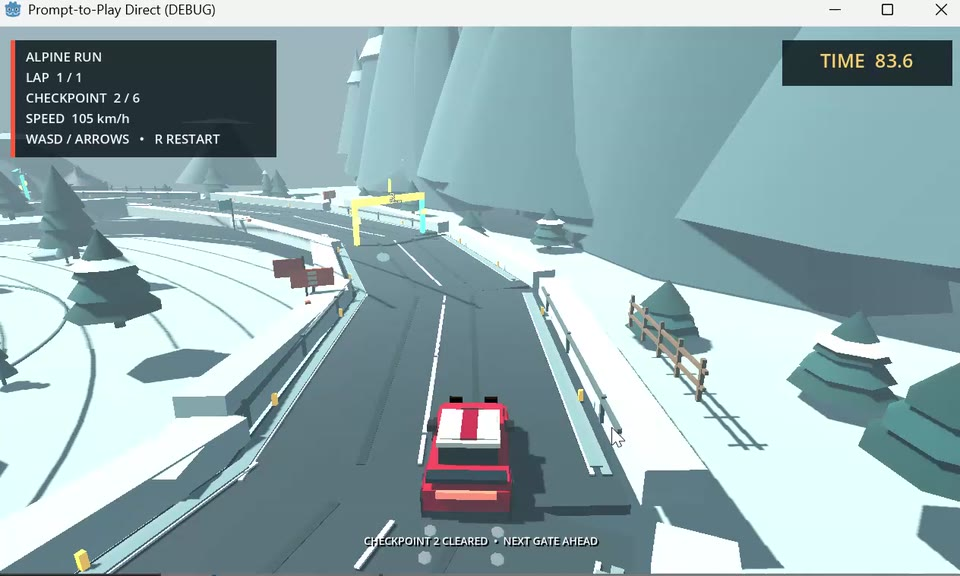
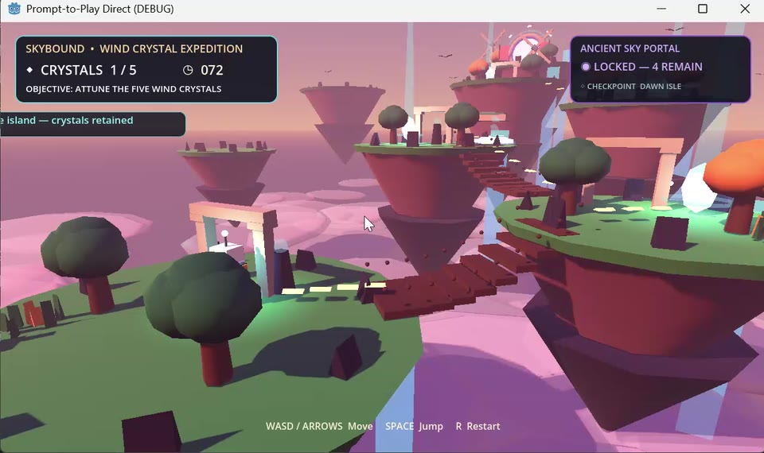
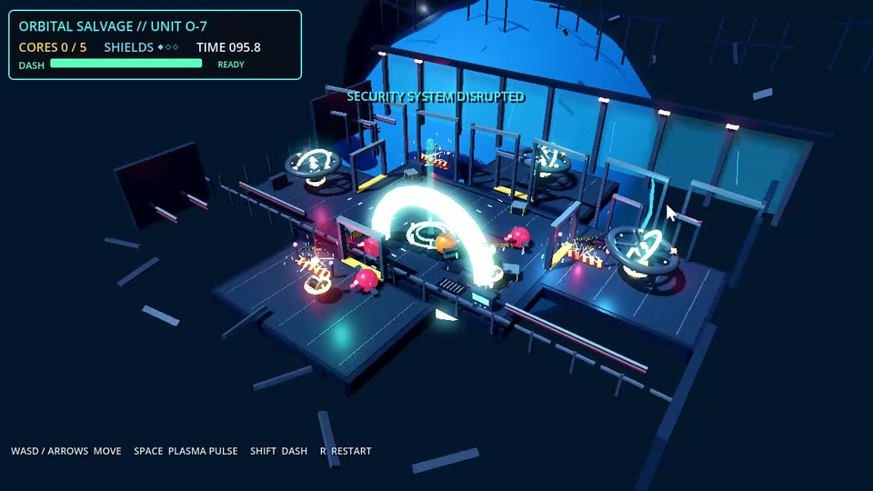
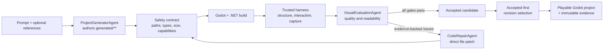

# Prompt-to-Play

<div align="center">

**Agent-driven generation, evaluation, and repair of playable Godot games**

Turn a natural-language game brief into an editable Godot project with automated build checks, interaction probes, visual evaluation, iterative repair, and evidence-backed revision selection.

[](https://github.com/DeepforThink/prompt-to-play/actions/workflows/tests.yml)


[](LICENSE.md)

</div>

## Overview

Prompt-to-Play accepts:

1. a natural-language game description; and
2. zero or more optional reference images.

The model writes real Godot scenes, scripts, resources, and shaders under `generated/**`. There is no WorldSpec, fixed entity vocabulary, or genre-specific intermediate representation between the prompt and the generated project.

Generation is followed by a host-controlled quality loop. Every candidate is validated, compiled, structurally inspected, interaction-tested, rendered, visually evaluated, and—when necessary—repaired by another model call. The final deliverable is a standard Godot project that can be reopened, edited, copied, and played without calling the model again.

## Demo Gallery

All three games below were produced by the same pipeline from text-only prompts. Click a cover to play the repository-hosted MP4.

| Alpine Valley Rally | Skybound: Wind Crystal Expedition | Orbital Salvage: Core Extraction |
| --- | --- | --- |
| [](media/demos/alpine-valley-rally.mp4) | [](media/demos/skybound-wind-crystal-expedition.mp4) | [](media/demos/orbital-salvage-core-extraction.mp4) |
| Snow rally driving with momentum, drifting, ordered checkpoints, and a timed lap. | Third-person floating-island platforming with crystals, checkpoints, hazards, and a final portal. | Isometric collection and combat with plasma pulses, shields, dash energy, and timed extraction. |
| [View prompt](prompts/snow-rally-demo.txt) | [View prompt](prompts/skybound-demo.txt) | [View prompt](prompts/orbital-salvage-demo.txt) |

## Features

- **Prompt-general game generation** — supports different genres, cameras, mechanics, objectives, layouts, and visual styles.
- **Direct Godot authoring** — the model produces actual `.tscn`, GDScript, C#, resource, shader, JSON, and Markdown files instead of a fixed scene specification.
- **Three isolated Agent roles** — project generation, visual evaluation, and evidence-guided code repair use separate model calls and structured contracts.
- **Trusted runtime harness** — the repository owns the entry point, build configuration, structural checks, interaction probes, and screenshot capture.
- **Automated correction loop** — compiler errors, scene failures, interaction failures, capture failures, and visual issues can all trigger a repair revision.
- **Best-revision recovery** — immutable candidate snapshots allow the host to restore the strongest playable revision after a regression.
- **Auditable evidence** — each revision records manifests, hashes, timings, Token usage, logs, screenshots, scores, and selection results.
- **Persistent output** — closing the game does not delete the generated project.
- **Provider compatibility** — supports OpenAI Responses-compatible endpoints through a masked local launcher.

## Architecture



### Agent Roles

| Agent | Inputs | Output | Responsibility |
| --- | --- | --- | --- |
| `ProjectGeneratorAgent` | Prompt and optional reference images | Complete `generated/**` file package | Implements the requested scene, gameplay, camera, UI, and presentation |
| `VisualEvaluationAgent` | Original request, references, and rendered captures | Structured scores and concrete issues | Evaluates prompt fidelity, composition, coherence, detail, lighting/materials, and gameplay readability |
| `CodeRepairAgent` | Current source plus compiler, structural, interaction, capture, and visual evidence | Bounded `generated/**` patch | Repairs implementation and presentation defects before the next validation pass |

The Agents do not decide whether a run succeeds. They produce files or evidence. Acceptance is derived by the trusted host from fixed build, structure, interaction, capture, and visual gates.

### Quality Loop

Each candidate revision passes through:

1. direct-file schema and static safety validation;
2. Godot/.NET compilation;
3. entry-scene, player, objective, HUD, camera, and renderable-content checks;
4. synthesized input with observable state-change verification;
5. one or two captures bound to the exact project hash;
6. structured visual evaluation;
7. evidence-guided repair when any gate fails.

The default configuration permits up to four repair revisions, with an internal hard ceiling of six. Accepted candidates always outrank rejected candidates. If no revision satisfies every gate, the best playable project and its evidence remain on disk for diagnosis, but the pipeline does not report it as a completed result.

### Trust Boundary

| Owner | Paths | Responsibility |
| --- | --- | --- |
| Repository host | `project.godot`, `.csproj`, `harness/**` | Stable entry point, build settings, structural checks, interaction probes, and capture |
| Model | `generated/**` | Prompt-specific game scene, logic, UI, resources, and shaders |
| Evidence writer | `artifacts/runs/<run-id>/rev_<n>/**` | Immutable manifests, logs, reports, captures, traces, and selection data |
| Reference publisher | `references/**` | Ordered, hashed copies of user-provided reference images |

Before any model response changes the project, the host rejects path traversal, absolute paths, links or junctions, unsupported extensions, oversized packages, unsafe resource references, and generated code that attempts process execution, network access, host-filesystem access, environment access, reflection, native interop, or unsafe C#.

See [docs/PROMPT_TO_PLAY.md](docs/PROMPT_TO_PLAY.md) for the detailed protocol.

## Getting Started

### Prerequisites

- Windows 10 or 11
- Python 3.11 or newer
- .NET 8 SDK
- Godot 4.7.x .NET/Mono edition
- an API key for an OpenAI Responses-compatible endpoint

The runtime does not require the Codex CLI. CPU-only systems can perform generation, compilation, and structural verification; a GPU improves rendering and visual-evaluation performance but is not required.

### Installation

```powershell
git clone https://github.com/DeepforThink/prompt-to-play.git
cd prompt-to-play
```

Verify the local toolchain:

```powershell
python --version
dotnet --version
godot --version
```

If automatic discovery does not locate the intended executables, set process-local paths:

```powershell
$env:PTP_DOTNET_EXE = "C:\path\to\dotnet.exe"
$env:PTP_GODOT_EXE = "C:\path\to\Godot_v4.7-stable_mono_win64.exe"
```

### Launch the Desktop Interface

The recommended Windows entry point reads the API key through masked input:

```powershell
powershell -ExecutionPolicy Bypass -File scripts/start_prompt_to_play_api.ps1
```

The default preset targets the Micu Responses-compatible endpoint with `gpt-5.6-sol`.

Other endpoint presets:

```powershell
# OpenAI
powershell -ExecutionPolicy Bypass -File scripts/start_prompt_to_play_api.ps1 -ApiProvider openai -Model <model-id>

# Custom Responses-compatible endpoint
powershell -ExecutionPolicy Bypass -File scripts/start_prompt_to_play_api.ps1 -ApiProvider custom -BaseUrl https://example.com/v1 -Model <model-id>
```

The launcher passes the key only through the child process environment and clears its own copy after startup. It does not write credentials to source files, Git, logs, or command-line arguments.

### Generate a Game

1. Enter a game description.
2. Optionally add reference images.
3. Select **Generate and Launch**.
4. Follow progress in the run log.
5. Play the selected project when the quality loop finishes.

Seed is derived internally from the canonical request. Time, Token usage, scores, and output hashes are recorded as evaluation results rather than exposed as required user inputs.

## Generated Output

Every request creates a unique project directory outside the source repository:

```text
../output/generated/<request-hash>/run-<id>/
├── project.godot
├── PromptToPlayDirect.csproj
├── generated/                  # selected model-authored source
├── harness/                    # trusted validation host
├── references/                 # optional hashed reference copies
└── artifacts/runs/<run-id>/
    ├── request.json
    ├── agent_trace.json
    ├── selection.json
    └── rev_<n>/
        ├── build.log
        ├── direct_status.json
        ├── direct_structural_report.json
        ├── direct_visual_feedback.json
        ├── captures/
        └── generated_snapshot.zip
```

Closing Godot does not remove the project. Open its `project.godot` again to play or edit it without another model call. An API key is required only when generating or repairing a different game.

## Evaluation Evidence

| Course metric | Evidence produced by Prompt-to-Play |
| --- | --- |
| Scene similarity | Visual comparison between the prompt/references and hashed captures |
| Structural correctness | Build result plus entry, gameplay, player, objective, HUD, camera, and interaction checks |
| Automation loop | Initial file package, per-revision patch/evaluation, immutable snapshots, and final selection |
| Generation speed | Stage-level timing for generation, publication, build, verification, capture, evaluation, repair, and restore |
| Token efficiency | Per-Agent input/output Token counts and model-call traces |
| Reproducibility | Canonical request, derived Seed, source/capture hashes, and repeated-run comparison |

An attractive screenshot cannot override a failed build or interaction probe. Conversely, a compilable scene cannot pass if it fails visual quality or gameplay-readability requirements.

## Repository Layout

| Path | Purpose |
| --- | --- |
| `prompt_to_play/direct_generation.py` | Direct-file schema, path/content safety checks, and atomic patch application |
| `prompt_to_play/direct_agents.py` | Project generation, visual evaluation, and code repair Agents |
| `prompt_to_play/direct_evaluation.py` | Visual feedback contract and host-owned quality gate |
| `prompt_to_play/direct_pipeline.py` | Generation, build, verification, capture, repair, selection, and launch orchestration |
| `prompt_to_play/direct_template/` | Trusted Godot host and generated-content boundary |
| `prompt_to_play/launcher.py` | Responsive desktop input and run-progress interface |
| `scripts/start_prompt_to_play_api.ps1` | Masked provider launcher |
| `prompts/` | Reproducible demonstration prompts |
| `media/demos/` | Curated showcase videos and poster images |
| `tests/` | Contract, safety, Agent, template, launcher, and pipeline tests |

Older schema-driven, multi-engine, publishing, and asset-generation modules are retained as upstream or implementation history. They are not used by the supported direct-generation entry point.

## Development

Run the test and static-analysis suite:

```powershell
python -m pytest -q
python -m compileall -q prompt_to_play scripts tests
ruff check prompt_to_play scripts tests
```

Before committing:

- keep API keys, `.env` files, personal paths, and private references out of Git;
- do not commit `output/`, `.godot/`, run artifacts, caches, local toolchains, or build products;
- keep original recordings outside the repository and add only compressed showcase media;
- verify that README links, demonstration prompts, and videos remain valid.

See [CONTRIBUTING.md](CONTRIBUTING.md) for contribution guidelines.

## Limitations

- The supported convenience launcher currently targets Windows.
- Output quality and determinism depend on the selected model and provider.
- Static code validation is a conservative safety boundary, not a replacement for an OS-level sandbox in production.
- Generated projects target Godot 4.7.x and may require migration for later engine versions.
- Exact source or pixel-level reproducibility is not guaranteed with nondeterministic providers; the pipeline records measured variation instead.

## Acknowledgements and License

Prompt-to-Play is built on the open-source work of [Godogen](https://github.com/htdt/godogen). This repository extends that foundation with direct arbitrary-prompt Godot generation, isolated generation/evaluation/repair Agents, trusted interaction and visual gates, immutable revision evidence, and best-candidate restoration.

Released under the [MIT License](LICENSE.md). Upstream attribution and license history are preserved.
