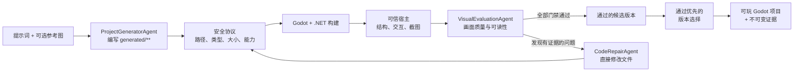

# Prompt-to-Play

<div align="center">

<p><a href="README.md">English</a> | <strong>简体中文</strong></p>

**由智能体驱动的 Godot 可玩游戏生成、评测与修复系统**

将自然语言游戏需求转化为可编辑的 Godot 项目，并自动执行构建检查、交互探测、视觉评测、迭代修复及基于证据的版本选择。

[](https://github.com/DeepforThink/prompt-to-play/actions/workflows/tests.yml)


[](LICENSE.md)

</div>

## 项目概述

Prompt-to-Play 接收：

1. 一段自然语言游戏描述；
2. 零张或多张可选参考图片。

模型直接在 `generated/**` 下编写真实的 Godot 场景、脚本、资源与着色器。提示词与最终项目之间不存在 WorldSpec、固定实体词表或针对特定游戏类型的中间表示。

生成完成后，流程进入由宿主程序控制的质量闭环。每个候选版本都会依次接受安全校验、编译、结构检查、交互测试、画面渲染和视觉评测；未达标时，系统会调用独立的修复智能体进行针对性修改。最终产物是标准 Godot 项目，生成后无需再次调用模型即可重新打开、编辑、复制和游玩。

## Demo 展示

以下三个游戏均由同一套流水线根据纯文本提示词生成。点击封面即可播放仓库中的 MP4 演示视频。

| 冰峰拉力：雪线竞速 | 云界远征：风晶之门 | 轨道拾荒者：核心撤离 |
| --- | --- | --- |
| [](media/demos/alpine-valley-rally.mp4) | [](media/demos/skybound-wind-crystal-expedition.mp4) | [](media/demos/orbital-salvage-core-extraction.mp4) |
| 具有惯性、漂移、顺序检查点和计时圈速的雪地拉力竞速。 | 包含水晶收集、检查点、机关与终点传送门的第三人称浮空岛平台冒险。 | 包含等离子脉冲、护盾、冲刺能量与限时撤离的等距视角收集战斗。 |
| [查看提示词](prompts/snow-rally-demo.txt) | [查看提示词](prompts/skybound-demo.txt) | [查看提示词](prompts/orbital-salvage-demo.txt) |

## 核心特性

- **面向任意提示词的游戏生成** —— 支持不同游戏类型、镜头、机制、目标、关卡布局与视觉风格。
- **直接编写 Godot 项目** —— 模型生成真实的 `.tscn`、GDScript、C#、资源、着色器、JSON 和 Markdown 文件，而不是填写固定场景规格。
- **三个相互隔离的智能体角色** —— 项目生成、视觉评测和基于证据的代码修复分别使用独立模型调用与结构化协议。
- **可信运行宿主** —— 仓库代码负责入口场景、构建配置、结构检查、交互探测与截图采集。
- **自动修正闭环** —— 编译错误、场景错误、交互失败、截图失败和视觉问题均可触发新一轮修复。
- **最佳版本恢复** —— 每轮候选版本都以不可变快照保存，出现回退时可恢复可玩性和评分最佳的版本。
- **可审计证据** —— 每个版本均记录清单、哈希、耗时、Token 用量、日志、截图、评分与最终选择结果。
- **项目持久化** —— 关闭游戏不会删除已经生成的工程。
- **兼容多种服务商** —— 通过本地掩码启动器连接兼容 OpenAI Responses API 的端点。

## 系统架构



### 智能体职责

| 智能体 | 输入 | 输出 | 职责 |
| --- | --- | --- | --- |
| `ProjectGeneratorAgent` | 提示词及可选参考图片 | 完整的 `generated/**` 文件包 | 实现指定场景、玩法、镜头、UI 与整体呈现 |
| `VisualEvaluationAgent` | 原始需求、参考图和渲染截图 | 结构化评分及具体问题 | 评估提示词匹配度、构图、视觉一致性、细节、光照材质与玩法可读性 |
| `CodeRepairAgent` | 当前源码以及编译、结构、交互、截图和视觉证据 | 受限于 `generated/**` 的补丁 | 在下一次验证前修复实现与呈现缺陷 |

智能体不负责决定一次运行是否成功，它们只负责生成文件或评价证据。最终是否通过，由可信宿主根据固定的构建、结构、交互、截图和视觉门禁判定。

### 质量闭环

每个候选版本依次经过：

1. 直接文件协议与静态安全检查；
2. Godot/.NET 编译；
3. 入口场景、玩家、目标、HUD、摄像机与可渲染内容检查；
4. 合成输入和可观测状态变化验证；
5. 与当前项目哈希绑定的一至两张截图；
6. 结构化视觉评测；
7. 任一门禁未通过时，执行基于证据的修复。

默认配置最多允许四轮修复，内部硬上限为六轮。通过全部门禁的候选版本始终优先于未通过版本。如果没有任何版本满足全部要求，系统仍会将最佳可玩项目及其证据保留在磁盘中供排查，但不会将其错误地报告为已完成结果。

### 信任边界

| 所有者 | 路径 | 职责 |
| --- | --- | --- |
| 仓库宿主 | `project.godot`、`.csproj`、`harness/**` | 稳定入口、构建配置、结构检查、交互探测与截图 |
| 模型 | `generated/**` | 与提示词对应的游戏场景、逻辑、UI、资源和着色器 |
| 证据写入器 | `artifacts/runs/<run-id>/rev_<n>/**` | 不可变的清单、日志、报告、截图、轨迹与选择结果 |
| 参考图发布器 | `references/**` | 按顺序保存并带哈希的用户参考图副本 |

任何模型响应修改项目之前，宿主都会拒绝路径穿越、绝对路径、链接或联接点、不支持的扩展名、超大文件包、不安全的资源引用，以及试图执行进程、访问网络、访问宿主文件系统、读取环境变量、使用反射、调用原生接口或包含不安全 C# 的生成代码。

完整协议见 [docs/PROMPT_TO_PLAY.md](docs/PROMPT_TO_PLAY.md)。

## 快速开始

### 环境要求

- Windows 10 或 Windows 11
- Python 3.11 或更高版本
- .NET 8 SDK
- Godot 4.7.x .NET/Mono 版本
- 兼容 OpenAI Responses API 的服务商密钥

运行时不依赖 Codex CLI。仅使用 CPU 也可以完成生成、编译和结构验证；GPU 能够改善渲染和视觉评测性能，但不是必需条件。

### 安装

```powershell
git clone https://github.com/DeepforThink/prompt-to-play.git
cd prompt-to-play
```

检查本地工具链：

```powershell
python --version
dotnet --version
godot --version
```

如果自动发现未能找到正确的可执行文件，可为当前进程设置路径：

```powershell
$env:PTP_DOTNET_EXE = "C:\path\to\dotnet.exe"
$env:PTP_GODOT_EXE = "C:\path\to\Godot_v4.7-stable_mono_win64.exe"
```

### 启动桌面界面

推荐使用 Windows 启动脚本，它会以掩码方式读取 API 密钥：

```powershell
powershell -ExecutionPolicy Bypass -File scripts/start_prompt_to_play_api.ps1
```

默认预设使用米醋（Micu）Responses 兼容端点和 `gpt-5.6-sol` 模型。

其他端点预设：

```powershell
# OpenAI
powershell -ExecutionPolicy Bypass -File scripts/start_prompt_to_play_api.ps1 -ApiProvider openai -Model <model-id>

# 自定义 Responses 兼容端点
powershell -ExecutionPolicy Bypass -File scripts/start_prompt_to_play_api.ps1 -ApiProvider custom -BaseUrl https://example.com/v1 -Model <model-id>
```

启动器只通过子进程环境变量传递密钥，并在启动后清除自身持有的副本。它不会把凭据写入源文件、Git、日志或命令行参数。

### 生成游戏

1. 输入游戏描述；
2. 根据需要添加参考图片；
3. 点击 **生成并启动**；
4. 在运行日志中查看进度；
5. 质量闭环结束后游玩最终选中的项目。

Seed 由规范化请求在内部自动推导。耗时、Token 用量、评分与输出哈希作为评价结果记录，而不是要求用户填写的输入项。

## 生成结果

每次请求都会在源码仓库之外创建独立项目目录：

```text
../output/generated/<request-hash>/run-<id>/
├── project.godot
├── PromptToPlayDirect.csproj
├── generated/                  # 最终选中的模型生成源码
├── harness/                    # 可信验证宿主
├── references/                 # 可选的哈希参考图副本
└── artifacts/runs/<run-id>/
    ├── request.json
    ├── agent_trace.json
    ├── selection.json
    └── rev_<n>/
        ├── build.log
        ├── direct_status.json
        ├── direct_structural_report.json
        ├── direct_visual_feedback.json
        ├── captures/
        └── generated_snapshot.zip
```

关闭 Godot 不会删除项目。之后可以再次打开其中的 `project.godot`，无需调用模型即可继续游玩或编辑。只有生成或修复另一个游戏时才需要 API 密钥。

## 评价证据

| 课程评价指标 | Prompt-to-Play 生成的证据 |
| --- | --- |
| 场景相似度 | 提示词/参考图与哈希绑定截图之间的视觉比较 |
| 结构正确性 | 构建结果以及入口、玩法、玩家、目标、HUD、摄像机和交互检查 |
| 自动化闭环 | 初始文件包、逐轮补丁与评测、不可变快照和最终版本选择 |
| 生成速度 | 生成、发布、构建、验证、截图、评测、修复和恢复等阶段的耗时 |
| Token 消耗 | 各智能体的输入/输出 Token 计数与模型调用轨迹 |
| 结果可复现性 | 规范化请求、派生 Seed、源码/截图哈希及多次运行对比 |

一张漂亮的截图不能掩盖构建失败或交互探测失败；同样，仅能成功编译的场景如果未达到视觉质量或玩法可读性要求，也不能通过评测。

## 仓库结构

| 路径 | 用途 |
| --- | --- |
| `prompt_to_play/direct_generation.py` | 直接文件协议、路径/内容安全检查与原子补丁应用 |
| `prompt_to_play/direct_agents.py` | 项目生成、视觉评测与代码修复智能体 |
| `prompt_to_play/direct_evaluation.py` | 视觉反馈协议和由宿主控制的质量门禁 |
| `prompt_to_play/direct_pipeline.py` | 生成、构建、验证、截图、修复、选择与启动编排 |
| `prompt_to_play/direct_template/` | 可信 Godot 宿主与生成内容边界 |
| `prompt_to_play/launcher.py` | 响应式桌面输入及运行进度界面 |
| `scripts/start_prompt_to_play_api.ps1` | 掩码服务商启动器 |
| `prompts/` | 可复现的 Demo 提示词 |
| `media/demos/` | 精选演示视频及封面图 |
| `tests/` | 协议、安全、智能体、模板、启动器与流水线测试 |

仓库中保留了早期基于 Schema、多引擎、发布和资产生成的模块，作为上游代码或实现历史参考。当前支持的直接生成入口不会使用这些模块。

## 开发

运行测试与静态分析：

```powershell
python -m pytest -q
python -m compileall -q prompt_to_play scripts tests
ruff check prompt_to_play scripts tests
```

提交前请确认：

- 不要将 API 密钥、`.env` 文件、个人路径或私有参考图提交到 Git；
- 不要提交 `output/`、`.godot/`、运行证据、缓存、本地工具链或构建产物；
- 原始录屏保留在仓库外，仅添加压缩后的精选展示媒体；
- README 链接、Demo 提示词和视频均可正常访问。

贡献规范见 [CONTRIBUTING.md](CONTRIBUTING.md)。

## 当前限制

- 当前提供的便捷启动脚本主要面向 Windows。
- 输出质量和确定性取决于所选模型及 API 服务商。
- 静态代码检查是一条保守的安全边界，生产环境中不能替代操作系统级沙箱。
- 生成项目面向 Godot 4.7.x，升级到后续引擎版本时可能需要迁移。
- 对于非确定性模型服务，无法保证源代码或像素级结果完全一致；流水线会记录实际测得的差异。

## 致谢与许可证

Prompt-to-Play 基于开源项目 [Godogen](https://github.com/htdt/godogen) 构建。本仓库在其基础上实现了面向任意提示词的直接 Godot 生成、相互隔离的生成/评测/修复智能体、可信交互与视觉门禁、不可变版本证据以及最佳候选版本恢复。

本项目依据 [MIT License](LICENSE.md) 发布，并保留上游项目的署名与许可证历史。
